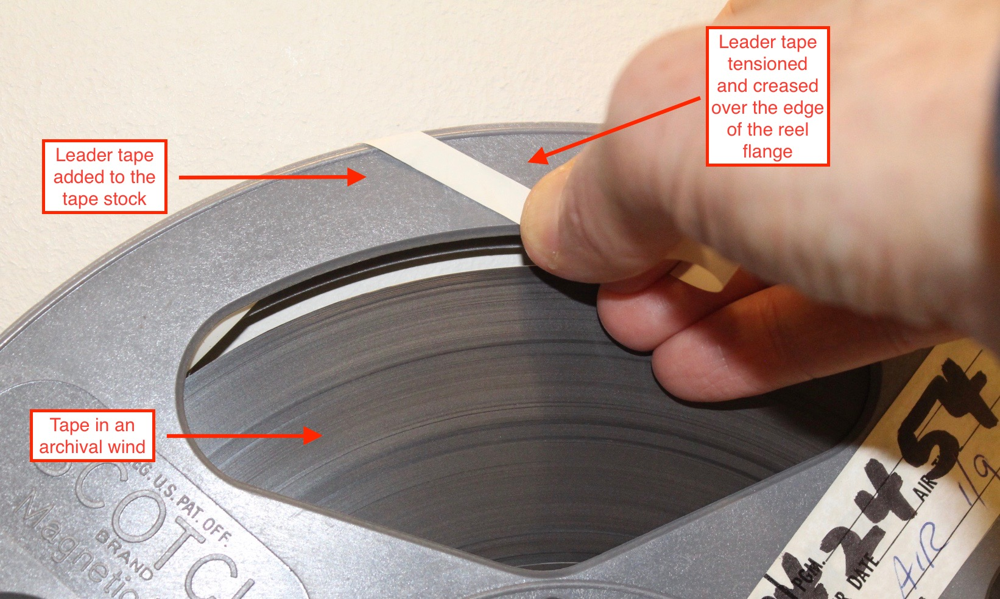
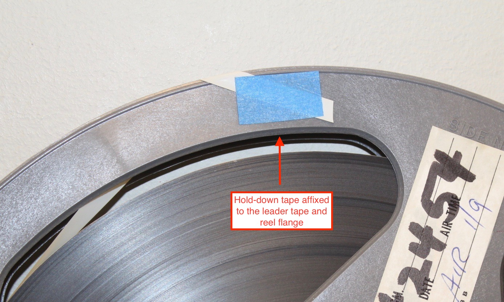

# Hold-down tape treatment

## Overview

Hold-down tape is affixed to open-reel tape to maintain the tape pack.

Hold-down tape is affixed:

* after the tape has been placed in an archival wind
* to leader tape (not to the tape stock) and to the flange of the reel
* in a location that does not obscure technical information about the tape stock
* in a location that does not obscure program information. 
* in a location that does not come in contact with the tape stock

## Supplies  

Paper-based hold-down tape. 

## Workflow

1) Add leader tape to the open-reel tape stock, as needed[see leader workflow].  

2) Assure that the tape is cleaned, repaired, and placed in an archival wind

3) Cut a ~1/2-inch piece of paper-based hold down tape.  

4) Pull on the leader tape, creasing it over the edge of the reel flange to evenly tension and secure the tape pack.  The correct amount of tension is strong enough to maintain the archival wind, but not so strong as to distort the tape pack. 
  
*Example 1* 

5) While still holding the tensioned leader tape in place, add the hold-down tape to affix the leader tape to the flange of the reel.

*Example 2*

